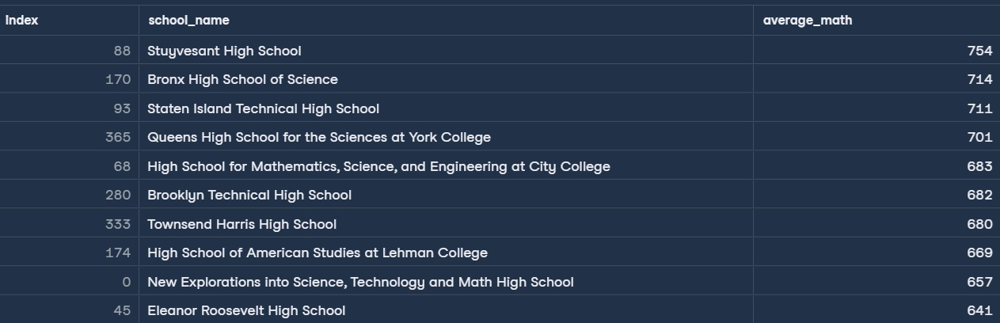
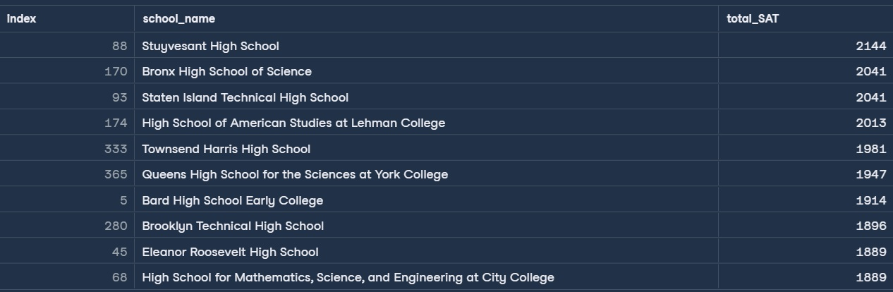
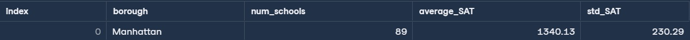

# Análisis de rendimiento escolar en NYC – SAT Scores

Este notebook presenta un análisis exploratorio de datos escolares en Nueva York, enfocado en el rendimiento en los exámenes SAT. El ejercicio fue desarrollado como parte de mi formación en DataCamp, y adaptado para mostrar buenas prácticas en pandas y visualización de KPIs. El caso práctico y el csv adjunto se obtuvieron de ahi.

## Archivos de soporte

A continuación se incluyen los archivos `schools.csv` que contiene la información de las escuelas para el análisis, y `NYC_SAT_Analysis.ipynb`, un notebook de Python con la implementación completa y ejecutable de la resolución.

- 📄 [schools.csv](Analysis-school-performance-NYC/schools.csv)
- 📄 [NYC_SAT_Analysis.ipynb](Analysis-school-performance-NYC/NYC_SAT_Analysis.ipynb) 

## Planteamiento del problema

Cada año, los estudiantes de secundaria estadounidenses presentan el SAT, un examen estandarizado que mide las habilidades de lectoescritura, aritmética y escritura. Consta de tres secciones: lectura, matemáticas y escritura, cada una con una puntuación máxima de 800 puntos. Estos exámenes son fundamentales para estudiantes y universidades, ya que desempeñan un papel fundamental en el proceso de admisión.

Analizar el rendimiento de las escuelas es crucial para diversas partes interesadas, como profesionales de la política y la educación, investigadores, el gobierno e incluso padres que deciden a qué escuela deberían asistir sus hijos.

Se le ha proporcionado un conjunto de datos llamado schools.csv, cuya vista previa se muestra a continuación.

Se le ha encomendado responder tres preguntas clave sobre el rendimiento de las escuelas públicas de la ciudad de Nueva York (NYC) en el SAT.
% del puntaje total (800)
1. ¿Qué escuelas de la Ciudad de Nueva York tienen los mejores resultados en matemáticas? Considerando los mejores aquellos que superen el 
2. ¿Cuáles son las 10 escuelas con mejor rendimiento según las puntuaciones combinadas del SAT?
3. ¿Qué distrito tiene la mayor desviación estándar en la puntuación combinada del SAT?

## Objetivos del análisis

1. Identificar las escuelas con mejores resultados en matemáticas (≥ 80% del puntaje máximo).
2. Calcular el top 10 de escuelas con mayor puntaje SAT combinado (math + reading + writing).
3. Determinar el borough con mayor variabilidad en puntajes SAT.

## Dataset

- **schools.csv**: contiene datos agregados por escuela, incluyendo puntajes promedio en lectura, matemáticas y escritura.
- Columnas: `school_name`, `borough`, `average_math`, `average_reading`, `average_writing`.

## Resolución y resultados
### 1. Previsualización de la información

Importamos la librería pandas y cargamos el dataset directamente desde GitHub. Aquí visualizamos la estructura de la información, e identificamos columnas clave como school_name, borough y los puntajes promedio en lectura, matemáticas y escritura.

```py
#Importing the pandas library for data manipulation
import pandas as pd

#Loading the dataset directly from GitHub
url = "https://raw.githubusercontent.com/oscargranada/OscarGranada-Analytics/b153266a07d79adf6ed067d39f37a221363dd6ec/python-data-exploration/Analysis-school-performance-NYC/schools.csv"
schools = pd.read_csv(url)

#Previewing the first rows of the dataset to understand its structure
schools.head()
```
Al ejecutar, se obtiene la vista previa de datos con los 5 primeros registros:

.jpg)

### 2. Cálculo de escuelas de la Ciudad de Nueva York con los mejores resultados en matemáticas
Calculamos qué escuelas alcanzaron al menos el 80% del puntaje máximo en matemáticas (640 puntos sobre 800). Este filtro nos permite identificar instituciones con un desempeño destacado en habilidades numéricas, ordenadas de mayor a menor según su puntaje promedio.

```py

#Identifying schools with strong math performance
# Criteria: average math score ≥ 80% of the maximum (800)
math_threshold = 800 * 0.8
best_math_schools = (
    schools[schools["average_math"] >= math_threshold][["school_name", "average_math"]]
    .sort_values(by="average_math", ascending=False)
)

print("1. Schools with top math scores:")
print(best_math_schools)
```
Al ejecutar, se obtiene el siguiente resultado:



Como podemos ver, 10 escuelas superaron el puntaje de 640 (80% del puntaje máximo) en el examen de matemáticas, siendo la escuela Stuyvesant High School la que ocupa el puesto número 1 con el mayor puntaje (754).

### 3. Calculo del top 10 de escuelas con mayor puntaje SAT combinado (math + reading + writing)
Creamos una nueva columna `total_SAT` que suma los puntajes promedio en matemáticas, lectura y escritura. A partir de esta métrica, seleccionamos las 10 escuelas con mejor rendimiento académico global, lo que ofrece una visión integral del desempeño estudiantil.

```py
#Calculating the total SAT score by summing math, reading, and writing scores
schools["total_SAT"] = (
    schools["average_math"] + schools["average_reading"] + schools["average_writing"]
)

#Selecting the top 10 schools based on total SAT score
top_10_schools = (
    schools[["school_name", "total_SAT"]]
    .sort_values(by="total_SAT", ascending=False)
    .head(10)
)

print("\n2. Top 10 schools by total SAT score:")
print(top_10_schools)
```
Al ejecutar, se obtiene el siguiente resultado:



Y como podemos apreciar dentro del top 10 de las escuelas con el mayor resultado SAT combinado,  la escuela Stuyvesant High School nuevamente ocupa el npuesto número 1. Esto nos da un indicio de la calidad educativa de dicha escuela, no solo en matemáticas, lo que podría influir en las decisiones de los padres de familia al momento de elegir la mejor escuela para sus hijos.

### 4. Cálculo del distrito con la mayor desviación estándar

Agrupamos las escuelas por distrito (`borough`) y calculamos el número de escuelas, el promedio y la desviación estándar del puntaje total SAT. Identificamos el distrito con mayor variabilidad, lo que puede reflejar desigualdad o diversidad en el rendimiento académico dentro de esa zona.

```py
# Analyzing SAT score variability across NYC boroughs
# Grouping by borough and calculating count, mean, and standard deviation
boroughs = (
    schools.groupby("borough")["total_SAT"]
    .agg(["count", "mean", "std"])
    .round(2)
)

# Identifying the borough with the highest standard deviation in SAT scores
largest_std_dev = boroughs[boroughs["std"] == boroughs["std"].max()]

# Renaming columns for clarity
largest_std_dev = largest_std_dev.rename(
    columns={"count": "num_schools", "mean": "average_SAT", "std": "std_SAT"}
)

# Resetting index to include 'borough' as a column
largest_std_dev.reset_index(inplace=True)

print("\n3. Borough with highest SAT score variability:")
print(largest_std_dev)

```
Al ejecutar, se obtiene el siguiente resultado:



Tenemos como resultado que el distrito de Manhattan tiene la mayor desviación estándar, con lo que podríamos intuir lo siguiente:

- Hay una gran dispersión en los puntajes, lo que sugiere que conviven escuelas con rendimientos muy altos y otros con puntajes más bajoss.
- Manhattan podría tener una mezcla de escuelas especializadas, preparatorias de élite, pero a la vez contar con escuelas con menos recursos, haciendo que aumente la brecha de desempeño.

## Reflexión

Este ejercicio demuestra cómo aplicar pandas para responder preguntas concretas de negocio o política pública. La lógica usada puede adaptarse fácilmente a entornos logísticos, financieros o de marketing, donde se requiere segmentar, priorizar y visualizar indicadores clave.

## 🔗 Enlaces

- [Notebook en GitHub](link-al-notebook)
- [Portafolio completo](https://github.com/oscargranada/OscarGranada-Analytics)
